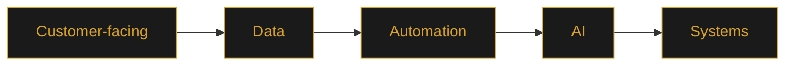

# GRACIÁN BAENA — PROFESSIONAL DECK

[🇬🇧 English](#-english) · [🇪🇸 Español](#-español)

---

## 🇬🇧 English

### Customer Success × Data × AI

*Palette · gold / nude / white — the Experience world of [gracianb.github.io/GracianB](https://gracianb.github.io/GracianB/)*

**I turn customer and operational problems into measurable systems.**

 

 

 

> **The case that can be verified: a Support OS in production.**
> An interactive deck, not a PDF.

 

### Contents

`01` [Profile](#01--profile) · `02` [Career](#02--career) · `03` [Customer Success](#03--customer-success) · `04` [Data & Analytics](#04--data--analytics) · `05` [Automation](#05--automation) · `06` [AI](#06--ai) · `07` [Systems](#07--systems) · `08` [Case study](#08--case-study) · `09` [Evidence](#09--evidence) · `10` [Capability map](#10--capability-map) · `11` [CV](#11--cv) · `12` [Contact](#12--contact)

 

### 01 · Profile

I sit in the space where **business problems meet technical execution**: Customer Success experience, structured through data, made efficient through automation, sharpened with AI.

The direction is always the same:

Not five separate identities — five layers of the same capability.

 

### 02 · Career

| | |
| :--- | :--- |
| **Based** | Murcia, Spain · Remote |
| **Background** | Customer Success, pricing and e-commerce environments |
| **Corporate roots** | Google / YouTube (Lisbon) |
| **Focus today** | Data-driven Customer Success, automation and applied AI |
| **Open to** | Senior roles, CS × Data × Ops |

 

### 03 · Customer Success

- Customer-facing operations across international portfolios
- Strategic customer support, not just ticket resolution
- Pricing and e-commerce environments
- Head of Customer Success experience — owning process, not just accounts

 

### 04 · Data & Analytics

- Operational reporting and dashboards
- Pricing intelligence
- Structured decision-making frameworks
- Large-scale spreadsheet and data-transformation workflows

 

### 05 · Automation

- Process automation for repetitive operational work
- Custom scripts and internal tooling
- Workflow optimization across CS and pricing operations

 

### 06 · AI

- AI-assisted workflows in analysis and support operations
- Applied AI experimentation, not just theory
- Prompt engineering for real operational interfaces
- Generative AI exploration inside production-adjacent tools

 

### 07 · Systems

- Connecting people, data and technology into workflows that keep running without me in the room
- Product thinking: every system exists to make a decision or an action easier

 

### 08 · Case study

**Bodytone Support OS** — the strongest signal in this portfolio, because it's public and it's live.

[Bodytone Support OS — public Help Center ↗](https://bodytonehelp.zendesk.com/hc/es)

 

### 09 · Evidence

The portfolio is built around **evidence rather than generic claims**.

<b>What's demonstrable, by area</b>

 

| Area | Evidence |
| :--- | :--- |
| Customer Success | Bodytone Support OS — live public Help Center |
| Data | Pricing intelligence models, operational dashboards |
| Automation | Internal tooling and scripted workflows in production use |
| AI | Applied experiments inside real CS/pricing workflows, not demos in isolation |
| Systems | End-to-end ticket → dashboard → follow-up pipeline (see case study above) |

> Show what exists instead of asking people to believe what is claimed.

 

### 10 · Capability map

| Capability | In practice |
| :--- | :--- |
| **Customer Success** | Understand customers, processes, friction and business needs |
| **Data & Analytics** | Turn operational data into decisions |
| **Automation** | Remove repetitive work, make processes reliable |
| **AI** | Apply AI to analysis, workflows and decision support |
| **Systems** | Connect people, data and technology into sustainable workflows |

 

### 11 · CV

 

### 12 · Contact

 

**Part of the [Gracián Baena hub](https://gracianb.github.io/GracianB/)** — Experience · [Systems](https://gracianb.github.io/systems-lab/) · [Personal](https://gracianb.github.io/yoga-instructor/)

 

---

 

## 🇪🇸 Español

### Customer Success × Data × AI

*Cromática · oro / nude / blanco — el mundo Experiencia de [gracianb.github.io/GracianB](https://gracianb.github.io/GracianB/)*

**Convierto problemas de cliente y de operación en sistemas medibles.**

 

 

 

> **El caso que se puede verificar: un Support OS en producción.**
> Un deck interactivo, no un PDF.

 

### Contenido

`01` [Perfil](#01--perfil) · `02` [Trayectoria](#02--trayectoria) · `03` [Customer Success](#03--customer-success-1) · `04` [Datos & Analítica](#04--datos--analítica) · `05` [Automatización](#05--automatización) · `06` [AI](#06--ai-1) · `07` [Sistemas](#07--sistemas) · `08` [Caso de estudio](#08--caso-de-estudio) · `09` [Evidencia](#09--evidencia) · `10` [Mapa de capacidades](#10--mapa-de-capacidades) · `11` [CV](#11--cv-1) · `12` [Contacto](#12--contacto)

 

### 01 · Perfil

Trabajo en el punto donde **el problema de negocio se encuentra con la ejecución técnica**: experiencia en Customer Success, estructurada con datos, hecha eficiente con automatización, afinada con AI.

La dirección es siempre la misma:

No son cinco identidades separadas — son cinco capas de la misma capacidad.

 

### 02 · Trayectoria

| | |
| :--- | :--- |
| **Ubicación** | Murcia, España · Remoto |
| **Background** | Customer Success, pricing y entornos e-commerce |
| **Raíces corporativas** | Google / YouTube (Lisboa) |
| **Foco actual** | Customer Success basado en datos, automatización y AI aplicada |
| **Abierto a** | Roles senior, CS × Data × Ops |

 

### 03 · Customer Success

- Operaciones de cara al cliente en carteras internacionales
- Soporte estratégico al cliente, no solo resolución de tickets
- Pricing y entornos e-commerce
- Experiencia como responsable de Customer Success — dueño del proceso, no solo de cuentas

 

### 04 · Datos & Analítica

- Reporting operativo y dashboards
- Inteligencia de precios
- Marcos de decisión estructurada
- Workflows de transformación de datos y hojas de cálculo a gran escala

 

### 05 · Automatización

- Automatización de procesos para trabajo operativo repetitivo
- Scripts a medida y herramientas internas
- Optimización de workflows en CS y operaciones de pricing

 

### 06 · AI

- Workflows asistidos por AI en análisis y operaciones de soporte
- Experimentación aplicada de AI, no solo teoría
- Prompt engineering para interfaces operativas reales
- Exploración de AI generativa dentro de herramientas cercanas a producción

 

### 07 · Sistemas

- Conectar personas, datos y tecnología en workflows que siguen funcionando sin que yo esté en la sala
- Product thinking: cada sistema existe para facilitar una decisión o una acción

 

### 08 · Caso de estudio

**Bodytone Support OS** — la señal más fuerte de este portfolio, porque es pública y está en producción.

```mermaid
flowchart LR
    A[Se abre ticket] --> B[Se asigna a un agente]
    B --> C["Se miden tiempos de 1ª / 2ª / 3ª respuesta"]
    C --> D[Se mide tiempo de resolución]
    D --> E[Alimenta un dashboard]
    E --> F[Mensajes automáticos de seguimiento]

    style A fill:#1a1a1a,stroke:#DAA428,color:#DAA428
    style B fill:#1a1a1a,stroke:#DAA428,color:#DAA428
    style C fill:#1a1a1a,stroke:#DAA428,color:#DAA428
    style D fill:#1a1a1a,stroke:#DAA428,color:#DAA428
    style E fill:#1a1a1a,stroke:#DAA428,color:#DAA428
    style F fill:#DAA428,stroke:#1a1a1a,color:#1a1a1a
```

[Bodytone Support OS — Help Center público ↗](https://bodytonehelp.zendesk.com/hc/es)

 

### 09 · Evidencia

El portfolio está construido en torno a **evidencia, no a afirmaciones genéricas**.

<b>Qué es demostrable, por área</b>

 

| Área | Evidencia |
| :--- | :--- |
| Customer Success | Bodytone Support OS — Help Center público en producción |
| Datos | Modelos de inteligencia de precios, dashboards operativos |
| Automatización | Herramientas internas y workflows scripteados en uso real |
| AI | Experimentos aplicados dentro de workflows reales de CS/pricing, no demos aisladas |
| Sistemas | Pipeline ticket → dashboard → seguimiento de extremo a extremo (ver caso arriba) |

> Mostrar lo que existe en vez de pedir que se crea lo que se afirma.

 

### 10 · Mapa de capacidades

| Capacidad | En la práctica |
| :--- | :--- |
| **Customer Success** | Entender clientes, procesos, fricción y necesidades de negocio |
| **Datos & Analítica** | Convertir datos operativos en decisiones |
| **Automatización** | Eliminar trabajo repetitivo, hacer los procesos fiables |
| **AI** | Aplicar AI al análisis, los workflows y la toma de decisiones |
| **Sistemas** | Conectar personas, datos y tecnología en workflows sostenibles |

 

### 11 · CV

 

### 12 · Contacto

 

**Parte del [hub de Gracián Baena](https://gracianb.github.io/GracianB/)** — Experiencia · [Sistemas](https://gracianb.github.io/systems-lab/) · [Personal](https://gracianb.github.io/yoga-instructor/)

