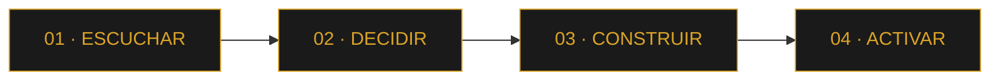

# GB · GRACIÁN BAENA

### Personas × Datos × Sistemas · Yoga × Presencia

*Centro de marca · Tres mundos · España · 2026*

Un solo centro. Tres puertas. Experiencia profesional, habilidad técnica, pasión yoga. **Elige tu mundo.**

 

 

 

## Índice

- [Qué es esto](#qué-es-esto)
- [Navegación del sitio](#navegación-del-sitio)
- [Método](#método)
- [Tres puertas](#tres-puertas)
- [PLAY · relájate o juega](#play--relájate-o-juega)
- [Cifras](#cifras)
- [Documentos](#documentos)
- [Contacto](#contacto)

 

## Qué es esto

**[gracianb.github.io/GracianB](https://gracianb.github.io/GracianB/)** es el hub personal de Gracián Baena — el punto de entrada que conecta sus tres mundos: experiencia profesional (Customer Success × Data × AI), habilidad técnica (Systems Lab) y una identidad personal (yoga).

Bilingüe (ES/EN), tema claro/oscuro, paleta de marca por mundo, y una paleta de comandos (`Ctrl` + `K`) para navegar sin ratón.

 

## Navegación del sitio

| Sección | Destino |
| :--- | :--- |
| **Mundos** | Los tres portales — Experiencia, PLAY, Yoga |
| **PLAY** | Ohana, Vórtice y el Help Center público |
| **Documentos** | 8 PDFs canónicos, ES/EN, un clic |
| **Contacto** | Email, agenda, LinkedIn, GitHub |

 

## Método

Cada mundo, y cada proyecto dentro de él, sigue el mismo recorrido:

 

## Tres puertas

Cada mundo tiene su cromática, su ritmo y su prueba. El hub es el centro que los conecta.

<table>
<tr>
<td width="33%" valign="top">

**01 · EXPERIENCIA**
*Cromática · oro / nude / blanco*

### [CS × Data × AI →](https://gracianb.github.io/professional-deck/)

Deck profesional interactivo — método, capability map y prueba en Zendesk.

- 14 slides · ES/EN
- Bodytone live + demos
- Capability map · experiencia
- Método Escuchar → Activar

*El caso que se puede verificar: Support OS en producción. Un deck interactivo, no un PDF.*

[Help Center live ↗](https://bodytonehelp.zendesk.com/hc/es)
`gracianb.github.io/professional-deck`

</td>
<td width="33%" valign="top">

**02 · PLAY**
*Cromática · hielo neón*

### [Systems Lab →](https://gracianb.github.io/systems-lab/)

Sistemas que se pulsan: Ohana, Vórtice y el Help Center.

- Ohana · canvas
- Vórtice · WebGL
- Zendesk + lab
- Chatbot demo + Aigoritmo

*Si no se abre en el navegador, no está. Juegos, CS público y un agente de ejemplo.*

[Jugar Ohana →](https://gracianb.github.io/project-ohana/) · [Abrir Vórtice →](https://vortex-gilt-xi.vercel.app/)
`gracianb.github.io/systems-lab`

</td>
<td width="33%" valign="top">

**03 · PASIÓN**
*Cromática · sage / presencia*

### [Presencia × Práctica →](https://gracianb.github.io/yoga-instructor/)

Instructor de yoga · Murcia · 2019–2026.

- Web zen · ES/EN
- Claro / oscuro
- CV y carta · 1 página
- Sala · 1:1 · equipos

*Certificado en Madrid, 2019. Corporativo en Google/YouTube. Sala en Murcia hasta junio 2026.*

[CV yoga ES ↗](https://gracianb.github.io/GracianB/Gracian_Baena_CV_Yoga_ES.pdf)
`gracianb.github.io/yoga-instructor`

</td>
</tr>
</table>

 

## PLAY · relájate o juega

El mundo técnico en su forma más lúdica: dos experiencias en vivo.

| Proyecto | Qué es | Abrir |
| :--- | :--- | :--- |
| **Ohana** | Un juego. Entra. | [Jugar →](https://gracianb.github.io/project-ohana/) |
| **Vórtice** | Mueve el cursor. Eso es todo. | [Abrir →](https://vortex-gilt-xi.vercel.app/) |

[Abrir el mundo PLAY completo →](https://gracianb.github.io/systems-lab/)

 

## Cifras

 

## Documentos

CVs y cartas listos para enviar — PDFs canónicos alojados en este hub, un clic, ES/EN.

<b>Experiencia · CS × Data × AI</b>

 

| Documento | Idioma | Enlace |
| :--- | :---: | :--- |
| CV Experiencia | ES | [Abrir →](https://gracianb.github.io/GracianB/Gracian_Baena_CV_2026_ES.pdf) |
| Experience CV | EN | [Abrir →](https://gracianb.github.io/GracianB/Gracian_Baena_CV_2026_EN.pdf) |
| Carta de presentación | ES | [Abrir →](https://gracianb.github.io/GracianB/Gracian_Baena_Carta_Presentacion_ES.pdf) |
| Cover letter | EN | [Abrir →](https://gracianb.github.io/GracianB/Gracian_Baena_Cover_Letter_EN.pdf) |

<b>Yoga · Presencia × Práctica</b>

 

| Documento | Idioma | Enlace |
| :--- | :---: | :--- |
| CV Yoga | ES | [Abrir →](https://gracianb.github.io/GracianB/Gracian_Baena_CV_Yoga_ES.pdf) |
| CV Yoga | EN | [Abrir →](https://gracianb.github.io/GracianB/Gracian_Baena_CV_Yoga_EN.pdf) |
| Carta Yoga | ES | [Abrir →](https://gracianb.github.io/GracianB/Gracian_Baena_Carta_Yoga_ES.pdf) |
| Cover Yoga | EN | [Abrir →](https://gracianb.github.io/GracianB/Gracian_Baena_Cover_Letter_Yoga_EN.pdf) |

<b>PLAY · Systems, live</b>

 

| Proyecto | Qué es | Enlace |
| :--- | :--- | :--- |
| Systems Lab | Hub técnico · hielo neón | [Abrir →](https://gracianb.github.io/systems-lab/) |
| Ohana | Un juego. Entra. | [Jugar →](https://gracianb.github.io/project-ohana/) |
| Vórtice | Mueve el cursor. Eso es todo. | [Abrir →](https://vortex-gilt-xi.vercel.app/) |
| Bodytone Support OS | Help Center en producción | [Abrir ↗](https://bodytonehelp.zendesk.com/hc/es) |

 

## Contacto

**Agenda 30 minutos, o escribe. Murcia · remoto.**

 

© 2026 Gracián Baena · *Personas × Datos × Sistemas · Yoga × Presencia*

[deck](https://gracianb.github.io/professional-deck/) · [yoga](https://gracianb.github.io/yoga-instructor/) · [lab](https://gracianb.github.io/systems-lab/) · [ohana](https://gracianb.github.io/project-ohana/) · [vórtice](https://vortex-gilt-xi.vercel.app/)

