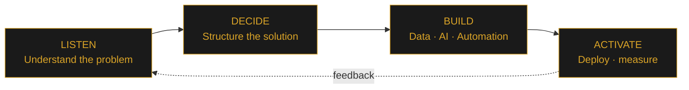
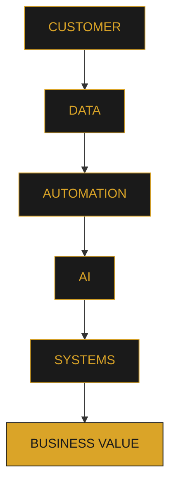
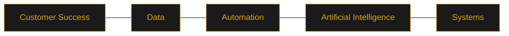

<div align="center">

# GRACIÁN BAENA

### Customer Success × Data × AI × Automation × Systems

*Professional Portfolio · Systems Lab · 2026*

I turn customer and operational problems into **measurable, automated and intelligent systems** — combining customer understanding, data, automation and AI.

<br>

[](https://gracianb.github.io/GracianB/)

[](https://www.linkedin.com/in/gracianbaena)
&nbsp;
[](https://github.com/GracianB)
&nbsp;
[](https://gracianb.github.io/professional-deck/)
&nbsp;
[](https://gracianb.github.io/systems-lab/)
&nbsp;
[](https://calendar.app.google/n99psBFktwYyoAWi9)
&nbsp;
[](mailto:gracianbaenagonzalez@gmail.com)

</div>

<br>

## Table of Contents

- [The professional signal](#the-professional-signal)
- [What I build](#what-i-build)
- [Selected ecosystem](#selected-ecosystem)
- [Technical satellites](#technical-satellites)
- [Professional evidence](#professional-evidence)
- [A real-world example](#a-real-world-example)
- [My operating model](#my-operating-model)
- [Why this combination matters](#why-this-combination-matters)
- [Portfolio metrics](#portfolio-metrics)
- [Documents](#documents)
- [Design & engineering](#design--engineering)
- [Repository](#repository)
- [Philosophy](#philosophy)
- [Current direction](#current-direction)
- [Connect](#connect)

<br>

## The professional signal

My career follows a consistent direction:

<div align="center">

**Customer-facing → Data → Automation → AI → Systems**

</div>

These are not five separate identities. They are different layers of the same capability:

> Understand the problem → structure the data → automate the work → apply AI where it creates value → build systems that scale.

My background combines customer success, pricing and e-commerce environments, data analysis, operational workflows, automation, AI experimentation and hands-on development.

This repository is the public hub connecting those layers.

<br>

## What I build

I am particularly interested in the space where **business problems meet technical execution**. The objective is not technology for technology's sake — the system has to solve something.

| Capability | What it means in practice |
| :--- | :--- |
| **Customer Success** | Understand customers, processes, friction and business needs |
| **Data & Analytics** | Turn operational data into useful information and decisions |
| **Automation** | Remove repetitive work and make processes more reliable |
| **AI** | Apply AI to analysis, workflows, interfaces and decision support |
| **Systems** | Connect people, data and technology into sustainable workflows |
| **Product thinking** | Turn problems into usable, measurable solutions |

<br>

## Selected ecosystem

The portfolio is organized around three complementary worlds.

<table>
<tr>
<td width="33%" valign="top">

**01 · EXPERIENCE**
### [Professional Deck →](https://gracianb.github.io/professional-deck/)
*Customer Success × Data × AI*

The professional layer — a visual presentation of my career, capabilities and approach to customer-facing, data-driven work.

`Customer Success` `Pricing` `E-commerce` `Data` `Analytics` `AI`

</td>
<td width="33%" valign="top">

**02 · SYSTEMS**
### [Systems Lab →](https://gracianb.github.io/systems-lab/)
*Experiments · Automation · AI · Dev*

The technical layer — a laboratory for turning ideas into working prototypes, interfaces, automations and systems.

`AI` `Automation` `JavaScript` `Python` `Web` `Systems`

</td>
<td width="33%" valign="top">

**03 · PERSONAL**
### [Yoga Instructor →](https://gracianb.github.io/yoga-instructor/)
*Yoga · Teaching · Presence*

A different dimension of the same person — discipline, teaching, presence and a long-term personal practice.

`Yoga` `Teaching` `Presence`

</td>
</tr>
</table>

<br>

## Technical satellites

Beyond the main portfolio, several projects explore different technical directions.

| Project | Type | Explore |
| :--- | :--- | :--- |
| **Project Ohana** | Interactive game / Canvas | [Open project](https://gracianb.github.io/project-ohana/) |
| **Vórtice** | WebGL experiment | [Open experiment](https://vortex-gilt-xi.vercel.app/) |
| **Systems Lab** | Technical portfolio | [Open lab](https://gracianb.github.io/systems-lab/) |
| **Professional Deck** | Career / capability portfolio | [Open deck](https://gracianb.github.io/professional-deck/) |
| **GitHub** | Code & experiments | [View profile](https://github.com/GracianB) |

<br>

## Professional evidence

The portfolio is intentionally built around **evidence rather than generic claims**.

<details>
<summary><b>Customer & business</b></summary>
<br>

- Customer Success experience
- Customer-facing operations
- Pricing and e-commerce environments
- International customer portfolio
- Strategic customer support

</details>

<details>
<summary><b>Data</b></summary>
<br>

- Data analysis
- Operational reporting
- Dashboards
- Pricing intelligence
- Structured decision-making
- Large-scale spreadsheet workflows

</details>

<details>
<summary><b>Automation</b></summary>
<br>

- Process automation
- Data transformation
- Operational tooling
- Workflow optimization
- Custom scripts and utilities

</details>

<details>
<summary><b>AI</b></summary>
<br>

- AI-assisted workflows
- Applied AI experimentation
- AI interfaces
- Prompt engineering
- AI-powered systems
- Generative AI exploration

</details>

<details>
<summary><b>Development</b></summary>
<br>

- HTML · CSS · JavaScript · Python
- APIs
- GitHub Pages
- Web applications
- Interactive interfaces

</details>

<br>

## A real-world example

One of the portfolio's strongest signals is the **Bodytone Support OS** — public evidence of work around customer support, operational information and structured workflows.

**Public support environment:** [Bodytone Support OS →](https://bodytonehelp.zendesk.com/hc/es)

> Show what exists instead of asking people to believe what is claimed.

<br>

## My operating model

Every project moves through four stages:



<br>

## Why this combination matters

Many professionals understand customers. Some understand data. Some build software. Some work with AI.

The interesting part is what happens **between those disciplines**:



That is the professional direction behind this repository.

<br>

## Portfolio metrics

The following figures describe the portfolio context and experience represented across the ecosystem.

<div align="center">


**ES / EN · Dark / Light · Responsive · Accessible**

</div>

> These figures are portfolio context, not performance guarantees.

<br>

## Documents

The repository includes a complete professional document set.

| Document | ES | EN |
| :--- | :---: | :---: |
| **Professional CV · 2026** | ✓ | ✓ |
| **Professional Cover Letter** | ✓ | ✓ |
| **Yoga CV** | ✓ | ✓ |
| **Yoga Cover Letter** | ✓ | ✓ |

The live hub provides access to the complete document collection.

<br>

## Design & engineering

The hub deliberately avoids unnecessary framework complexity — a lightweight static experience built with intent.

| Layer | Details |
| :--- | :--- |
| **Frontend** | HTML · CSS · JavaScript |
| **Platform** | GitHub Pages |
| **UX** | Responsive · Dark/Light · ES/EN · Keyboard navigation · Reduced motion |
| **Discovery** | SEO · Open Graph · Twitter Cards · Schema.org · Sitemap · Robots |
| **Interface** | Command palette · Accessible focus states · Progressive enhancement |
| **Visual system** | Fraunces · Inter · JetBrains Mono |

The visual language uses a restrained palette built around warm black, champagne, ice and sage — closer to a **digital professional studio** than a conventional résumé website.

<br>

## Repository

<details>
<summary><b>View file structure</b></summary>

```text
GracianB/
│
├── index.html
├── styles.css
├── main.js
├── i18n.js
│
├── favicon.svg
├── og-cover.png
├── og-cover.svg
├── site.webmanifest
│
├── robots.txt
├── sitemap.xml
├── 404.html
├── SECURITY.md
│
├── .github/
│   └── workflows/
│       └── site-check.yml
│
├── Gracian_Baena_CV_2026_ES.pdf
├── Gracian_Baena_CV_2026_EN.pdf
│
├── Gracian_Baena_CV_Yoga_ES.pdf
├── Gracian_Baena_CV_Yoga_EN.pdf
│
├── Gracian_Baena_Carta_Presentacion_ES.pdf
├── Gracian_Baena_Cover_Letter_EN.pdf
│
├── Gracian_Baena_Carta_Yoga_ES.pdf
└── Gracian_Baena_Cover_Letter_Yoga_EN.pdf
```

</details>

<br>

## Philosophy

> Fewer claims. More evidence.
>
> Fewer disconnected projects. More systems.
>
> Less decoration for decoration's sake. More useful design.
>
> Less automation theater. More measurable outcomes.

Technology is a means. The interesting question is always:

> What problem does it solve?

<br>

## Current direction

The next stage of the portfolio is focused on the convergence of:



The goal is to build increasingly capable systems that make information easier to understand, work easier to execute and decisions easier to make.

<br>

## Connect

<div align="center">

**Gracián Baena**
Murcia, Spain · Remote

**Customer Success × Data × AI × Automation × Systems**

| Channel | Link |
| :--- | :--- |
| LinkedIn | [linkedin.com/in/gracianbaena](https://www.linkedin.com/in/gracianbaena) |
| GitHub | [github.com/GracianB](https://github.com/GracianB) |
| Portfolio | [gracianb.github.io/GracianB](https://gracianb.github.io/GracianB/) |
| Professional Deck | [professional-deck](https://gracianb.github.io/professional-deck/) |
| Systems Lab | [systems-lab](https://gracianb.github.io/systems-lab/) |
| 30-min meeting | [Book a meeting](https://calendar.app.google/n99psBFktwYyoAWi9) |
| Email | [gracianbaenagonzalez@gmail.com](mailto:gracianbaenagonzalez@gmail.com) |

<br>

### ONE HUB. THREE WORLDS. ONE PROFESSIONAL NARRATIVE.

**[GRACIANB.GITHUB.IO/GRACIANB →](https://gracianb.github.io/GracianB/)**

*Listen → Decide → Build → Activate*

</div>
