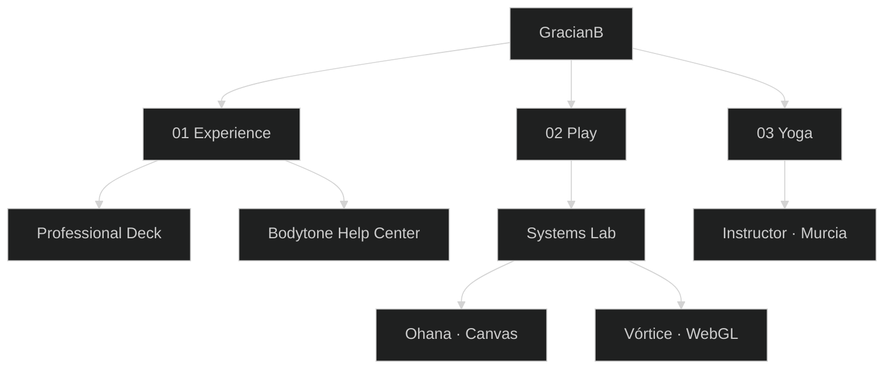
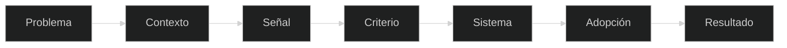

 

  

**Customer Success · Data · AI · Automation · Systems**

Convierto problemas de personas y de operación en sistemas que se pueden abrir y medir.

Murcia · España · remoto · 2026
· [LinkedIn](https://www.linkedin.com/in/gracianbaena)
· [Email](mailto:gracianbaenagonzalez@gmail.com)
· [30 min](https://calendar.app.google/n99psBFktwYyoAWi9)

 

[Español](#español) · [English](#english)

---

## En treinta segundos

| | |
| --- | --- |
| **Quién** | Tecnólogo del lado de las personas. Uno el problema humano con el sistema. |
| **Qué** | Customer Success, datos, pricing, IA y automatización. |
| **Prueba** | 16+ años · 10+ de cara al cliente · 200+ reglas de precio · 5+ centros · Help Center en producción |
| **Por dónde** | [Deck](https://gracianb.github.io/professional-deck/) · [Lab](https://gracianb.github.io/systems-lab/) · [Yoga](https://gracianb.github.io/yoga-instructor/) |

<table>
<tr>
<td width="33%" align="center">

### 01 · Experience
**Personas × datos**

Customer Success, pricing, e-commerce, analítica.

[Abrir el deck](https://gracianb.github.io/professional-deck/)

</td>
<td width="33%" align="center">

### 02 · Play
**Sistemas que se pulsan**

Ohana, Vórtice y el laboratorio.

[Entrar al lab](https://gracianb.github.io/systems-lab/)

</td>
<td width="33%" align="center">

### 03 · Yoga
**Presencia × práctica**

Sala y wellness corporativo desde 2019.

[Entrar a yoga](https://gracianb.github.io/yoga-instructor/)

</td>
</tr>
</table>

---

## Español

Este repositorio es el hub. No es un CV suelto ni una lista de repos. Desde aquí salen las tres puertas.

No empiezo por la herramienta. Empiezo por el problema.

Escuchar, decidir, construir, activar. Un sistema que nadie usa es ingeniería con autoestima.

### Las tres puertas

**Experience.** Trayectoria, método y la prueba pública: el [Help Center de Bodytone](https://bodytonehelp.zendesk.com/hc/es). El relato largo está en el [deck](https://gracianb.github.io/professional-deck/).

**Play.** El [Systems Lab](https://gracianb.github.io/systems-lab/) es el sitio donde las cosas se abren. Ohana no es un experimento de IA. Es un platformer de Canvas.

| Proyecto | Qué es | Estado |
| --- | --- | --- |
| [Ohana](https://gracianb.github.io/project-ohana/) | Canvas 2D. Isla Hoku. 10 salas, 10 personajes, de bebé a GOD. | Live |
| [Vórtice](https://vortex-gilt-xi.vercel.app/) | WebGL. Mueves el cursor y los puntos te siguen. | Live |
| [Agente de ejemplo](https://gracianb.github.io/systems-lab/#agente) | Cómo se siente un canal con agente. Sin claves. No es producción. | Ejemplo |

**Yoga.** Instructor desde 2019. La tecnología arma sistemas. El yoga recuerda que dentro hay personas. [Sitio](https://gracianb.github.io/yoga-instructor/).

### Números

| | |
| --- | --- |
| Experiencia | 16+ años |
| Cara al cliente | 10+ años |
| Reglas de pricing | 200+ |
| Centros | 5+ |
| Países | 4 |
| En producción, verificable | Help Center de Bodytone |
| Juegos que se abren ahora | Ohana y Vórtice |

Idiomas: español, inglés, italiano, portugués, francés.

### Qué hago

| Área | |
| --- | --- |
| Customer Success | Adopción, retención, formación |
| Datos | Análisis, pricing, KPIs |
| IA | GenAI, agentes, flujos. Con una persona que cierra. |
| Automatización | n8n, Make, Zapier |
| Sistemas | HTML, CSS, JavaScript, Python. Canvas y WebGL cuando el caso es un juego. |
| Personas | Comunicación, yoga, wellness |

La herramienta es lo de menos. La pregunta es qué problema resuelve.

### Lo que se puede abrir

| Sistema | Estado | |
| --- | --- | --- |
| Bodytone Support OS | Producción | [Help Center](https://bodytonehelp.zendesk.com/hc/es) |
| Ohana | Live | [Jugar](https://gracianb.github.io/project-ohana/) |
| Vórtice | Live | [Abrir](https://vortex-gilt-xi.vercel.app/) |
| Professional Deck | Live | [Deck](https://gracianb.github.io/professional-deck/) |
| Yoga | Live | [Sitio](https://gracianb.github.io/yoga-instructor/) |

<b>PDFs</b>

 

| Documento | |
| --- | --- |
| CV 2026 · ES | [PDF](./Gracian_Baena_CV_2026_ES.pdf) |
| CV 2026 · EN | [PDF](./Gracian_Baena_CV_2026_EN.pdf) |
| Carta · ES | [PDF](./Gracian_Baena_Carta_Presentacion_ES.pdf) |
| Cover letter · EN | [PDF](./Gracian_Baena_Cover_Letter_EN.pdf) |
| CV yoga · ES | [PDF](./Gracian_Baena_CV_Yoga_ES.pdf) |
| CV yoga · EN | [PDF](./Gracian_Baena_CV_Yoga_EN.pdf) |

---

## English

This repository is the hub. Not a loose CV, and not a list of repos. Three doors leave from here.

I do not start with the tool. I start with the problem: context, signal, criteria, system, adoption, outcome. A system nobody uses is engineering with an ego.

**Experience.** Track record, method, and the public proof: the [Bodytone Help Center](https://bodytonehelp.zendesk.com/hc/es). The long version is the [deck](https://gracianb.github.io/professional-deck/).

**Play.** The [Systems Lab](https://gracianb.github.io/systems-lab/) is where things open. Ohana is not an AI experiment. It is a Canvas platformer.

| Project | What it is | Status |
| --- | --- | --- |
| [Ohana](https://gracianb.github.io/project-ohana/) | Canvas 2D. Isla Hoku. 10 rooms, 10 characters, from baby to GOD. | Live |
| [Vórtice](https://vortex-gilt-xi.vercel.app/) | WebGL. Move the cursor. The points follow. | Live |
| [Sample agent](https://gracianb.github.io/systems-lab/#agente) | How a channel feels with an agent. No keys. Not production. | Example |

**Yoga.** Instructor since 2019. Technology builds systems. Yoga remembers there are people inside them. [Site](https://gracianb.github.io/yoga-instructor/).

| | |
| --- | --- |
| Experience | 16+ years |
| Customer-facing | 10+ years |
| Pricing rules | 200+ |
| Centres | 5+ |
| Countries | 4 |
| In production | Bodytone Help Center |
| Games you can open | Ohana and Vórtice |

Languages: Spanish, English, Italian, Portuguese, French.

Customer Success, data, pricing, GenAI and automation (n8n, Make, Zapier), and the web stack behind the public sites: HTML, CSS, JavaScript, Python. Canvas and WebGL when the case is a game.

---

### Construyamos algo útil

  

Respuesta habitual en 48 horas.
Proyectos, consultoría, colaboración, docencia.

 

[Deck](https://gracianb.github.io/professional-deck/) · [Lab](https://gracianb.github.io/systems-lab/) · [Yoga](https://gracianb.github.io/yoga-instructor/) · [Hub](https://gracianb.github.io/GracianB/)

 

Murcia · 2026

